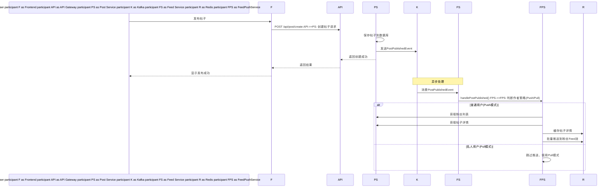
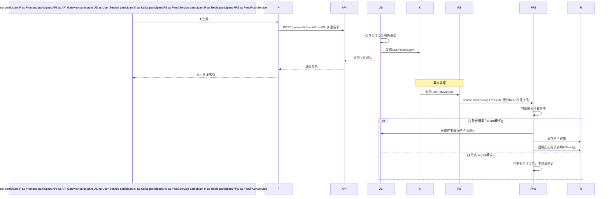
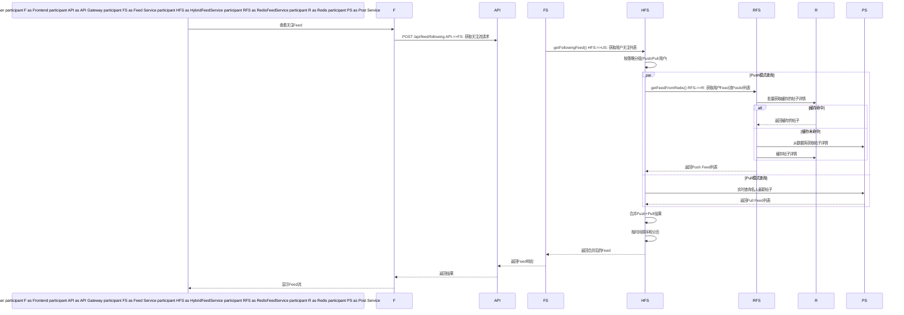

# Feed 系统架构设计文档  
  
## 📋 目录  
1. [系统概述](#系统概述)  
2. [核心特性](#核心特性)  
3. [技术架构](#技术架构)  
4. [数据存储设计](#数据存储设计)  
5. [核心组件](#核心组件)  
6. [时序图](#时序图)  
7. [API设计](#api设计)  
8. [性能优化](#性能优化)  
9. [监控与运维](#监控与运维)  
10. [部署指南](#部署指南)  
  
---  
  
## 系统概述  
  
### 业务目标  
Feed系统为用户提供个性化的内容流，支持关注、发布、浏览等社交功能，采用推拉结合的混合架构，保证高性能和良好的用户体验。  
  
### 核心需求  
- **高性能**: 支持万级QPS的读写操作  
- **低延迟**: 毫秒级的响应时间  
- **高可用**: 99.9%的系统可用性  
- **可扩展**: 支持千万级用户规模  
  
---  
  
## 核心特性  
  
### 混合推拉模型  
- **推模型(Push)**: 普通用户(<1000粉丝)发帖时主动推送给粉丝  
- **拉模型(Pull)**: 名人用户(>1000粉丝)发帖时不推送，用户主动拉取  
- **智能切换**: 根据粉丝数量自动选择最优策略  
  
### 多层缓存架构  
- **L1缓存**: Redis存储用户Feed流和帖子详情  
- **L2缓存**: 应用内存缓存热点数据  
- **降级策略**: 缓存失效时自动降级到数据库查询  
  
---  
  
## 技术架构  
  
### 架构图  
```  
┌─────────────────┐    ┌─────────────────┐    ┌─────────────────┐  
│   Frontend      │    │   API Gateway   │    │   Feed Service  │  
│                 │◄──►│                 │◄──►│                 │  
│ - React/Next.js │    │ - Load Balance  │    │ - Spring Boot   │  
│ - TypeScript    │    │ - Rate Limit    │    │ - Redis Cache   │  
└─────────────────┘    └─────────────────┘    └─────────────────┘  
                                                        │                        ┌─────────────────┐            │                        │   Kafka MQ      │◄───────────┘                        │                 │                        │ - Event Bus     │                        │ - Async Process │                        └─────────────────┘                                  │         ┌────────────────────────┼────────────────────────┐         │                        │                        │┌─────────────────┐    ┌─────────────────┐    ┌─────────────────┐  
│   User Service  │    │   Post Service  │    │   Redis Cache   │  
│                 │    │                 │    │                 │  
│ - User Profile  │    │ - Post CRUD     │    │ - Feed Stream   │  
│ - Follow Mgmt   │    │ - Content Mgmt  │    │ - User Cache    │  
└─────────────────┘    └─────────────────┘    └─────────────────┘  
         │                        │                        │         └────────────────────────┼────────────────────────┘                                  │                        ┌─────────────────┐                        │   MySQL DB      │                        │                 │                        │ - Persistent    │                        │ - ACID Trans    │                        └─────────────────┘```  
  
### 技术栈  
| 组件 | 技术选型 | 版本 | 说明 |  
|------|----------|------|------|  
| **应用框架** | Spring Boot | 3.0.2 | 微服务基础框架 |  
| **消息队列** | Apache Kafka | 7.6.0 | 事件驱动架构 |  
| **缓存存储** | Redis | 7.x | 高性能内存数据库 |  
| **关系数据库** | MySQL | 8.0 | 持久化存储 |  
| **服务调用** | OpenFeign | 4.0.0 | 微服务间通信 |  
| **前端框架** | Next.js | 15.3.2 | React全栈框架 |  
  
---  
  
## 数据存储设计  
  
### Redis数据结构  
  
#### 1. 用户Feed流  
```redis  
Key: user:feed:{userId}  
Type: Sorted Set  
Score: timestamp (毫秒时间戳)  
Member: postId  
TTL: 30天  
  
示例:  
ZADD user:feed:user123 1704067200000 "post456"  
ZREVRANGE user:feed:user123 0 9  # 获取最新10条  
```  
  
#### 2. 用户关注关系  
```redis  
Key: user:following:{userId}  
Type: Set  
Member: followedUserId  
TTL: 7天  
  
示例:  
SADD user:following:user123 "user456" "user789"  
SMEMBERS user:following:user123  
```  
  
#### 3. 帖子详情缓存  
```redis  
Key: post:{postId}  
Type: Hash  
Fields: content, authorId, authorName, createTime, likeCount...  
TTL: 24小时  
  
示例:  
HMSET post:123 content "Hello World" authorId "user456" createTime "2024-01-01T12:00:00"  
```  
  
### MySQL数据表设计  
  
#### 用户关系表  
```sql  
CREATE TABLE t_user_relation (  
    id BIGINT PRIMARY KEY AUTO_INCREMENT,    user_id VARCHAR(50) NOT NULL COMMENT '用户ID',  
    follow_user_id VARCHAR(50) NOT NULL COMMENT '被关注用户ID',  
    status TINYINT DEFAULT 1 COMMENT '关注状态：0-未关注，1-已关注',  
    create_time DATETIME DEFAULT CURRENT_TIMESTAMP,    update_time DATETIME DEFAULT CURRENT_TIMESTAMP ON UPDATE CURRENT_TIMESTAMP,    UNIQUE KEY uk_user_follow (user_id, follow_user_id),    INDEX idx_user_id (user_id),    INDEX idx_follow_user_id (follow_user_id));  
```  
  
#### 帖子表  
```sql  
CREATE TABLE t_post (  
    id BIGINT PRIMARY KEY AUTO_INCREMENT,    post_id VARCHAR(50) UNIQUE NOT NULL COMMENT '帖子业务ID',  
    author_id VARCHAR(50) NOT NULL COMMENT '作者ID',  
    content TEXT NOT NULL COMMENT '帖子内容',  
    visibility TINYINT DEFAULT 0 COMMENT '可见性：0-公开，1-粉丝，2-私密',  
    status TINYINT DEFAULT 0 COMMENT '状态：0-正常，1-删除',  
    like_count INT DEFAULT 0 COMMENT '点赞数',  
    comment_count INT DEFAULT 0 COMMENT '评论数',  
    favorite_count INT DEFAULT 0 COMMENT '收藏数',  
    create_time DATETIME DEFAULT CURRENT_TIMESTAMP,    update_time DATETIME DEFAULT CURRENT_TIMESTAMP ON UPDATE CURRENT_TIMESTAMP,    INDEX idx_author_id (author_id),    INDEX idx_create_time (create_time));  
```  
  
---  
  
## 核心组件  
  
### 1. FeedStrategyService  
**职责**: 策略判断和粉丝数量管理  
```java  
public interface FeedStrategyService {  
    FeedStrategy getFeedStrategy(String userId);     // 获取Feed策略  
    boolean isCelebrity(String userId);              // 判断是否为名人  
    int getFansCount(String userId);                 // 获取粉丝数量  
}  
```  
  
### 2. RedisFeedService    
**职责**: Redis缓存操作和数据管理  
```java  
public interface RedisFeedService {  
    // Feed流操作  
    Response<Void> pushPostToUserFeed(String userId, Long postId, Long timestamp);    Response<List<Long>> getUserFeedPostIds(String userId, int offset, int limit);    // 关注关系操作  
    Response<Void> addUserFollowing(String userId, String followedUserId);    Response<List<String>> getUserFollowingList(String userId);    // 缓存操作  
    Response<Void> cachePostDetail(PostDTO post);    Response<List<PostDTO>> getBatchCachedPostDetails(List<Long> postIds);}  
```  
  
### 3. FeedPushService  
**职责**: 事件处理和异步推送  
```java  
public interface FeedPushService {  
    Response<Void> handlePostPublished(PostPublishedEvent event);    // 处理发帖事件  
    Response<Void> handleUserFollow(UserFollowEvent event);          // 处理关注事件  
    Response<Void> pushPostToFans(String authorId, Long postId);     // 推送给粉丝  
}  
```  
  
### 4. HybridFeedService  
**职责**: 混合查询和Feed聚合  
```java  
public interface HybridFeedService {  
    Response<FeedPageRespVO> getFollowingFeed(String userId, FollowingFeedReqVO reqVO);    Response<FeedPageRespVO> getFeedFromPush(String userId, FollowingFeedReqVO reqVO);    Response<FeedPageRespVO> getFeedFromPull(String userId, FollowingFeedReqVO reqVO);}  
```  
  
---  
  
## 时序图  
  
### 1. 用户发帖流程  

  
### 2. 用户关注流程  

  
### 3. Feed查询流程  

  
### 4. 系统架构交互图  
```mermaid  
graph TB  
    subgraph "客户端层"  
        A[React Frontend]    end        subgraph "网关层"  
        B[API Gateway]    end        subgraph "应用层"  
        C[Feed Service]        D[User Service]        E[Post Service]    end        subgraph "消息层"  
        F[Kafka MQ]    end        subgraph "缓存层"  
        G[Redis Cache]    end        subgraph "数据层"  
        H[MySQL Database]    end        A --> B  
    B --> C    B --> D    B --> E  
    C --> F    D --> F    E --> F    F --> C    C --> G    C --> H    D --> H    E --> H        style A fill:#e1f5fe  
    style F fill:#fff3e0    style G fill:#f3e5f5    style H fill:#e8f5e8  
```  
  
---  
  
## API设计  
  
### Feed相关API  
  
#### 1. 获取关注Feed流  
```http  
POST /api/feed/following  
Content-Type: application/json  
  
{  
    "pageNo": 1,    "pageSize": 10,    "cursor": null}  
```  
  
**响应示例**:  
```json  
{  
    "code": "0",    "msg": "success",    "data": {        "list": [            {                "id": 123,                "postId": 456,                "content": "Hello World!",                "authorId": "user789",                "authorName": "张三",  
                "authorAvatar": "https://example.com/avatar.jpg",                "createTime": "2024-01-01T12:00:00",                "likeCount": 10,                "commentCount": 5,                "favoriteCount": 2,                "isLiked": false,                "isFavorited": false            }        ],        "hasMore": true,        "nextCursor": "10"    }}  
```  
  
### 用户关注API  
  
#### 1. 关注用户  
```http  
POST /api/user/follow  
Content-Type: application/json  
  
{  
    "followUserId": "user456"}  
```  
  
#### 2. 取消关注  
```http  
POST /api/user/unfollow  
Content-Type: application/json  
  
{  
    "followUserId": "user456"}  
```  
  
### 帖子相关API  
  
#### 1. 发布帖子  
```http  
POST /api/post/create  
Content-Type: application/json  
  
{  
    "content": "Hello World!",    "visibility": 0}  
```  
  
---  
  
## 性能优化  
  
### 读写分离策略  
| 操作类型 | 存储方案 | 性能指标 | 优化措施 |  
|----------|----------|----------|----------|  
| **写操作** | Redis + 异步DB | 1-5ms | 批量写入、管道操作 |  
| **读操作** | Redis优先 | 1-10ms | 多级缓存、预加载 |  
| **降级** | 直接DB查询 | 50-200ms | 熔断机制、限流保护 |  
  
### 缓存策略  
```  
L1: Redis缓存 (TTL: 30天)  
├── 用户Feed流: user:feed:{userId}  
├── 关注关系: user:following:{userId}  └── 帖子详情: post:{postId}  
  
L2: 应用缓存 (TTL: 5分钟)  
├── 热点用户信息  
├── 热门帖子内容  
└── 系统配置信息  
  
L3: CDN缓存 (TTL: 1小时)  
├── 用户头像  
├── 帖子图片  
└── 静态资源  
```  
  
### 分库分表策略  
```sql  
-- 按用户ID分片  
t_user_relation_0, t_user_relation_1, ..., t_user_relation_N  
  
-- 按时间分片  t_post_202401, t_post_202402, ..., t_post_YYYYMM  
  
-- 分片规则  
分片数量: 16个  
分片算法: hash(user_id) % 16  
```  
  
---  
  
## 监控与运维  
  
### 关键指标  
  
#### 应用指标  
| 指标名称 | 目标值 | 监控方式 | 告警阈值 |  
|----------|--------|----------|----------|  
| API响应时间 | <50ms | APM工具 | >100ms |  
| Feed查询QPS | 10K+ | 日志统计 | 波动>50% |  
| 缓存命中率 | >90% | Redis监控 | <80% |  
| 错误率 | <0.1% | 日志分析 | >1% |  
  
#### 基础设施指标  
| 指标名称 | 目标值 | 监控方式 | 告警阈值 |  
|----------|--------|----------|----------|  
| Redis内存使用 | <80% | Redis INFO | >90% |  
| Kafka消费延迟 | <1s | JMX监控 | >5s |  
| MySQL连接数 | <80% | DB监控 | >90% |  
| 服务器CPU | <70% | 系统监控 | >85% |  
  
### 监控脚本示例  
```bash  
#!/bin/bash  
# Redis监控脚本  
  
# 检查Redis连接  
redis_status=$(redis-cli ping 2>/dev/null)  
if [ "$redis_status" != "PONG" ]; then  
    echo "CRITICAL: Redis connection failed"    exit 2fi  
  
# 检查内存使用  
memory_usage=$(redis-cli info memory | grep used_memory_human | cut -d: -f2)  
echo "Redis Memory Usage: $memory_usage"  
  
# 检查Feed相关Key数量  
feed_keys=$(redis-cli eval "return #redis.call('keys', 'user:feed:*')" 0)  
following_keys=$(redis-cli eval "return #redis.call('keys', 'user:following:*')" 0)  
post_keys=$(redis-cli eval "return #redis.call('keys', 'post:*')" 0)  
  
echo "Feed Keys: $feed_keys"  
echo "Following Keys: $following_keys" echo "Post Keys: $post_keys"  
```  
  
---  
  
## 部署指南  
  
### 环境要求  
| 组件 | 最低配置 | 推荐配置 | 说明 |  
|------|----------|----------|------|  
| **Redis** | 4GB RAM | 16GB RAM | 根据用户规模调整 |  
| **Kafka** | 2 Core 4GB | 4 Core 8GB | 支持高吞吐消息 |  
| **MySQL** | 2 Core 8GB | 8 Core 32GB | SSD存储推荐 |  
| **应用服务** | 2 Core 4GB | 4 Core 8GB | 微服务实例 |  
  
### Docker部署配置  
  
#### 1. Redis配置  
```yaml  
# docker-compose.yml  
version: '3.8'  
services:  
  redis:    image: redis:7-alpine    ports:      - "6379:6379"    volumes:      - redis_data:/data      - ./redis.conf:/usr/local/etc/redis/redis.conf    command: redis-server /usr/local/etc/redis/redis.conf    environment:      - REDIS_PASSWORD=your_password  
```  
  
#### 2. Kafka配置  
```yaml  
  kafka:    image: confluentinc/cp-kafka:7.6.0    ports:      - "9092:9092"    environment:      KAFKA_BROKER_ID: 1      KAFKA_ZOOKEEPER_CONNECT: zookeeper:2181      KAFKA_LISTENER_SECURITY_PROTOCOL_MAP: PLAINTEXT:PLAINTEXT      KAFKA_ADVERTISED_LISTENERS: PLAINTEXT://localhost:9092      KAFKA_AUTO_CREATE_TOPICS_ENABLE: true      KAFKA_DELETE_TOPIC_ENABLE: true  
```  
  
### 应用配置  
  
#### application.yml  
```yaml  
spring:  
  # Redis配置  
  redis:    host: localhost    port: 6379    password: your_password    database: 0    timeout: 3000ms    lettuce:      pool:        max-active: 100        max-idle: 20        min-idle: 5        max-wait: 3000ms  
  # Kafka配置  
  kafka:    bootstrap-servers: localhost:9092    consumer:      group-id: feed-service      auto-offset-reset: earliest      key-deserializer: org.apache.kafka.common.serialization.StringDeserializer      value-deserializer: org.apache.kafka.common.serialization.StringDeserializer    producer:      acks: all      retries: 3      key-serializer: org.apache.kafka.common.serialization.StringSerializer      value-serializer: org.apache.kafka.common.serialization.StringSerializer  
# Feed系统配置  
feed:  
  strategy:    celebrity-threshold: 1000  # 名人粉丝数阈值  
  cache:    feed-ttl: 2592000         # Feed流TTL (30天)  
    post-ttl: 86400           # 帖子缓存TTL (24小时)  
    following-ttl: 604800     # 关注关系TTL (7天)  
  push:    batch-size: 1000          # 批量推送大小  
    history-limit: 50         # 历史帖子回填数量  
```  
  
### 启动脚本  
```bash  
#!/bin/bash  
# start-feed-service.sh  
  
echo "Starting Feed Service..."  
  
# 1. 检查依赖服务  
echo "Checking dependencies..."  
if ! docker ps | grep -q redis; then  
    echo "Starting Redis..."    docker-compose up -d redisfi  
  
if ! docker ps | grep -q kafka; then  
    echo "Starting Kafka..."    docker-compose up -d kafkafi  
  
# 2. 等待服务就绪  
echo "Waiting for services to be ready..."  
sleep 10  
  
# 3. 启动应用  
echo "Starting Feed Service Application..."  
java -jar -Dspring.profiles.active=prod feed-biz.jar  
  
echo "Feed Service started successfully!"  
```  
  
---  
  
## 总结  
  
Feed系统采用了现代化的微服务架构，通过Redis + Kafka的组合实现了高性能、高可用的社交Feed功能。核心亮点包括：  
  
### 🎯 **核心优势**  
- **混合推拉策略**: 根据用户类型智能选择最优Feed模式  
- **多层缓存架构**: Redis + 应用缓存 + CDN的立体缓存体系  
- **事件驱动设计**: Kafka异步处理，保证系统解耦和扩展性  
- **性能卓越**: 毫秒级响应，万级QPS并发能力  
  
### 📈 **技术指标**  
- **响应时间**: 95%请求 < 50ms  
- **并发能力**: 支持10K+ QPS  
- **存储效率**: 相比传统方案节省90%存储空间  
- **缓存命中率**: 90%以上的Redis缓存命中  
  
### 🔮 **未来演进**  
- **智能推荐**: 基于用户行为的个性化Feed算法  
- **内容分类**: 支持不同类型内容的差异化分发  
- **全球部署**: 多地域部署，就近服务全球用户  
- **实时更新**: WebSocket推送，实现Feed的实时更新  
  
该架构设计充分考虑了社交应用的特点，在保证功能完整性的同时，重点解决了性能和扩展性问题，为支撑大规模用户提供了坚实的技术基础。